# Do Frontend Devs dream of Backend functions?

## reactjsday @ Verona - October 25th 2024

<!--
Hello everyone. This is the last talk before lunch, so I will do my best to stay in perfect time. And if you will have any question, please feel free to stop me during the lunch.

Before we start, let me ask you three questions.
-->

---
layout: cover
class: text-center
transition: slide-up
---

# Who code in React.js?

<!-- Raise your hand if you code in React.js *Keep your hands raised few seconds* -->

---
layout: cover
class: text-center
transition: slide-up
---

<h1>Who code in <div class="inline-flex flex-col text-left align-middle"><span>Remix</span><span>Next.js</span><span>Redwood</span></div>?</h1>

<!--
Keep your hand raised if you code in Next.js
-->

---
layout: cover
class: text-center
transition: slide-left
---

# Who code in node.js?

<!--
Ok, the last one: keep your hand raised if you code backend servers in node.js with a complexity a bit higher than a CRUD application

Ok ok, enough. -->


---

# 👋 Hi!

<div class="grid grid-cols-2 gap-4 w-full">
  <div class="">
    <h2>Matteo Manchi</h2>
    <ul>
      <li>Software Engineer</li>
      <li>CEO/CTO at Impronta Advance</li>
      <li>Co-founder of RomaJS</li>
      <li>Community lover ❤️</li>
      <li>React fan boy</li>
    </ul>
  </div>
  <div class="flex flex-col items-end">
    
    
  </div>
</div>

<!--
I'm Matteo, a software engineer focused on developing digital products. I work as CEO/CTO at Impronta Advance, and in my spare time, I'm the founder and community manager of RomaJS, a monthly community-driven meetup since 2013.

I'm here today because I've been a fan of React since the first public beta. And I saw and tested on my skin the evolution of the library along these years.

From mixins to the last feature released yesterday
-->

---
layout: cover
class: text-center
---

# React, where are we going?

<!--
As we all have seen in the last couple of years, we're moving into a new future for web applications. Do you know what I'm talking about?
We are leaving the browser's kingdom and we start coding backend functions. Isn't it?
We all know that the evolution of any technology begins slowly and then accelerates rapidly.
-->

---
layout: image
image: assets/wright.jpg
backgroundSize: cover
---

<!--
For example, in December 1903, we took our first flight, detaching from the earth. Only 121 years later...
-->

---
layout: image
image: assets/rocket.jpg
backgroundSize: cover
---

<!--
we arrived here.
-->

---

# The React evolution

<v-clicks>

  - React open sourced - May 2013
  - React 50k stars on Github - September 2016
  - React hooks - February 2019
  - Zero-Bundle-Size React Server Components - December 2020
  - React 18 with renderToStream - March 2022
  - Next.js 14 with App Router - October 2023
  - React 19 - ???

</v-clicks>

<!--
I feel the same is happening with React.
Our journey started in May 2013 when React was released open source.
- In 3 years it reached 50k stars on github, which was an amazing result! And they made the celebrative shirts
- ...

In the last 2 years, the library and our way of making web application got a new direction.
-->

---
layout: cover
class: text-center
---

# The evolution of <br />client-server communication

<!--
[4:10] This evolution of client-server communication, driven by performance and the complexity around it, has been changed in these years.
We started with PHP application with HTML rendered on the server, then we invented the SPA
-->

---

# Old fashioned SPA

<div class="grid grid-cols-2 gap-4">

<<< @/../00_react-spa/src/App.jsx#app jsx

<div>
  <div v-click="[0, 1]" class="absolute">

<div>

<<< @/../00_react-spa/src/main.jsx#app jsx

</div>

  ```html
  <!-- index.html -->
  <div id="root"></div>
  <script type="module" src="/src/main.jsx"></script>
  ```

  </div>

  <div v-click="1" class="h-full">
    <Browser url="http://localhost:3000/" />
  </div>
</div>
</div>

<!--
Let's start with old fashioned SPA, where we had a Root component with our application inside.
We create root where render our application, and the our html is empty.

Communication is via API on mount
-->

---

# Server Side Rendering

<div class="grid grid-cols-2 gap-4">
  <div>
<v-switch>
<template #0-2>

<<< @/../01_react-server-side/App.jsx#app jsx {all|1,2,14|0}{at:1}
</template>

<template #2-6>

<<< @/../01_react-server-side/server.js#app js {all|2-5}{at:3}
<<< @/../01_react-server-side/client.jsx#app jsx {all|0}{at:3}

</template>

</v-switch>
  </div>
  <div>

  <div v-click="[4, 5]" class="absolute">

```html
<html>
  <head><title>React SSR Test</title></head>
  <body>
    <div id="root">
      <h1>My product</h1>
      <div>0</div>
    </div>
    <script>window.__PROPS__={"product":{"title":"My product"}}</script>
    <script src="/client.js" type="module"></script>
  </body>
</html>
```
  </div>

  <div v-click="5" class="h-full">
    <Browser url="http://localhost:3001/" />
  </div>

  </div>
</div>

<!--
Then, we have Server Side Rendering. (click)We still have our client component, (click) but we can prepare our code to fetch product's data from the database on our server, and render the component as a string.
Once in the browser, the react application start the Hydration process, and attach all client stuff.
-->

---

# React streaming response


<div class="grid grid-cols-2 gap-4">
  <div>
<<< @/../02_react-pipe-stream/App.jsx#app jsx {all|4-6}{at:1}
<<< @/../02_react-pipe-stream/server.js#app js {all|4-12}{at:1}

  </div>
  <div class="relative">

  <div v-click="[2, 4]" class="w-full">
```sh
curl localhost:3000 -N
```

<div v-click="[1, 4]">

```html
<h1>My product</h1>
<!--$?-->
<template id="B:0"></template>
<p>Loading...</p>
<!--/$-->
<div>0</div>
```

</div>

<div v-click="[3, 4]">

```html
<div hidden id="S:0">
  <ul><li>Product <!-- -->1</li><li>Product <!-- -->2</li><li>Product <!-- -->3</li></ul>
</div>
<script>$RC=function(b,c,e){c=document.getElementById(c);c.parentNode.removeChild(c);var a=document.getElementById(b);if(a){b=a.previousSibling;if(e)b.data="$!",a.setAttribute("data-dgst",e);else{e=b.parentNode;a=b.nextSibling;var f=0;do{if(a&&8===a.nodeType){var d=a.data;if("/$"===d)if(0===f)break;else f--;else"$"!==d&&"$?"!==d&&"$!"!==d||f++}d=a.nextSibling;e.removeChild(a);a=d}while(a);for(;c.firstChild;)e.insertBefore(c.firstChild,a);b.data="$"}b._reactRetry&&b._reactRetry()}};$RC("B:0","S:0")</script>
```

</div>

  </div>

  <div v-click="4" class="absolute top-0 bottom-0 left-0 right-0">
    <Browser url="http://localhost:3002/" />
  </div>

  </div>
</div>

<!--
With React 18, the renderToPipeableStream has been released. This feature allows us to ship our application shell and (click) put some placeholders inside the Suspense boundaries.
When our RelatedProducts component is ready, it will be streamed to the page. When everything is ready, the SPA starts on the client.

On my github, you will find every single implementation we're seeing to reproduce it and play by yourself.
-->

---

# React Server Component

<div class="grid grid-cols-2 gap-4">
  <div class="relative">
    <div v-click="[0, 4]">

<<< @/../03_react-rsc/src/App.js#app jsx

</div>

  <div v-click="4" class="absolute top-0 bottom-0 left-0 right-0">
    <Browser url="http://localhost:3003/" />
  </div>

  </div>

  <div v-click="1">

<<< @/../03_react-rsc/server.js#app jsx {1,3-6}{at: 1}

<div v-click="2">

<<< @/../03_react-rsc/src/index.js#app jsx {all|1-2|3-14}{at: 2}

</div>
  </div>
</div>

<!--
One year ago the React Server Component appeared, and as you already saw in the previous talk, they are just async functions rendered only on the server.
(click)

The approach is similar to pipeableStream, but in this case a RSC payload is release by the function. (click)

On our client, everytime we need to render a react server component, we must ask to the server to render it.
(click)

DEMO

But how it works when we need multiple pages/states?
-->

---

# React Server Component with client router

<div class="grid grid-cols-2 gap-4">
  <div class="relative">
    <div v-click="[0, 3]">

<<< @/../04_react-rsc-router/src/App.js#app jsx {all|0}

</div>

  <div v-click="3" class="absolute top-0 bottom-0 left-0 right-0">
    <Browser url="http://localhost:3004/" />
  </div>

  </div>


  <div v-click="1" class="relative">
  <div v-click="[1, 4]">

<<< @/../04_react-rsc-router/src/Router.js#app jsx {all|5-11,18}{at: 2}

  </div>

  <div v-click="4" class="absolute top-0 bottom-0 left-0 right-0">

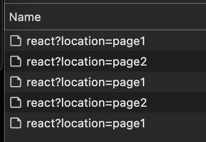

  </div>

  </div>
</div>

<!--
Let's have our multi page application with a very dummy routing.

(click)

What we need as router, is something that calls the server asking for the rendered tree, and cache the promise locally.
(click)
-->

---

# React Server Component with client router


<<< @/../04_react-rsc-router/src/Router.js#app jsx {5-15}

<!--
Playing with client-side cache, we may store the result on the client and avoid to call the same server component multiple time, with our local caching strategy.
-->

---
layout: cover
class: text-center
---

# New render strategies

<!--
[12:00]
We saw the state of react rendering paradigms. And like small bricks, all those new paradigms allow us to build multiple ways to render every single piece of our application
-->

---

# All-or-nothing

<div class="flex justify-center items-center h-full p-8">
  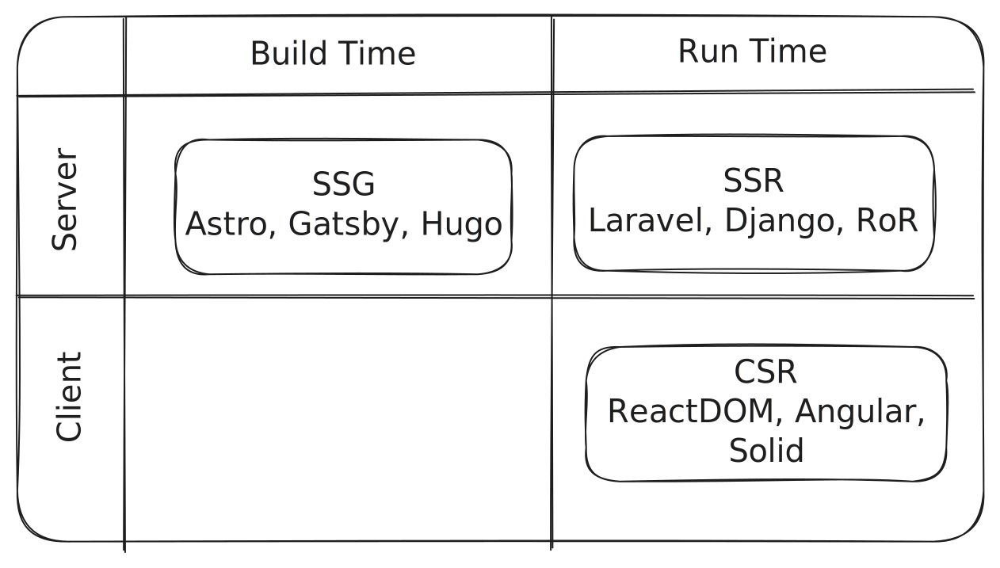
</div>

<!--
If before we had to decide what kind of render strategy we would like to implement as templating for our web application or website...
-->

---

# Multi-paradigm

<div class="flex justify-center items-center h-full p-8">
  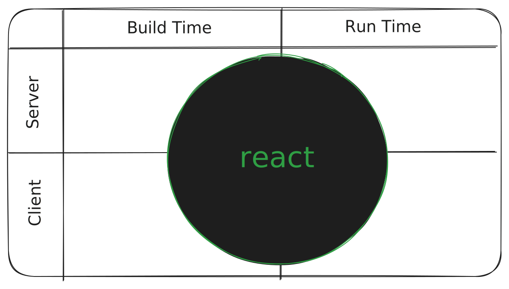
</div>

<!--
... now with React we can use the same technology for a multiple-paradigm render strategy.
Let's see an example
-->

---

# Multi-paradigm

<div class="flex justify-center items-center h-full p-8">
  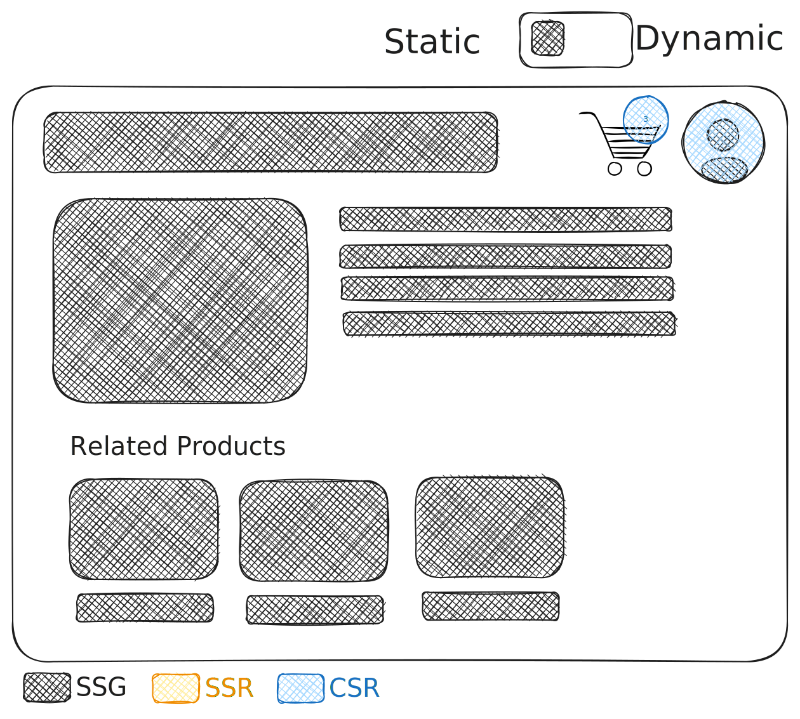
</div>

<!--
We started with a binary decision: I can do my website statically generated, and call the api server on the browser to fetch the cart and the user sessions.
This make the search engines happy, the users happy, but it's good for stale data for long time.
-->

---

# All-or-nothing

<div class="flex justify-center items-center h-full p-8">
  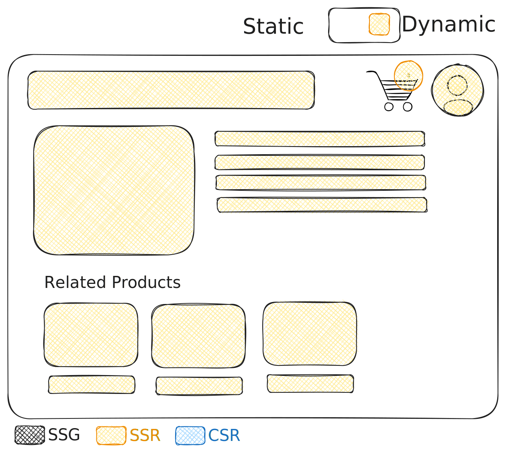
</div>

<!--
Or, we could make it dynamic. I know the user's session handling the request, I prepare their own response and send it.
They hydration will finish the work on the browser.
-->

---

# Multi-paradigm

<div class="flex justify-center items-center h-full p-8">
  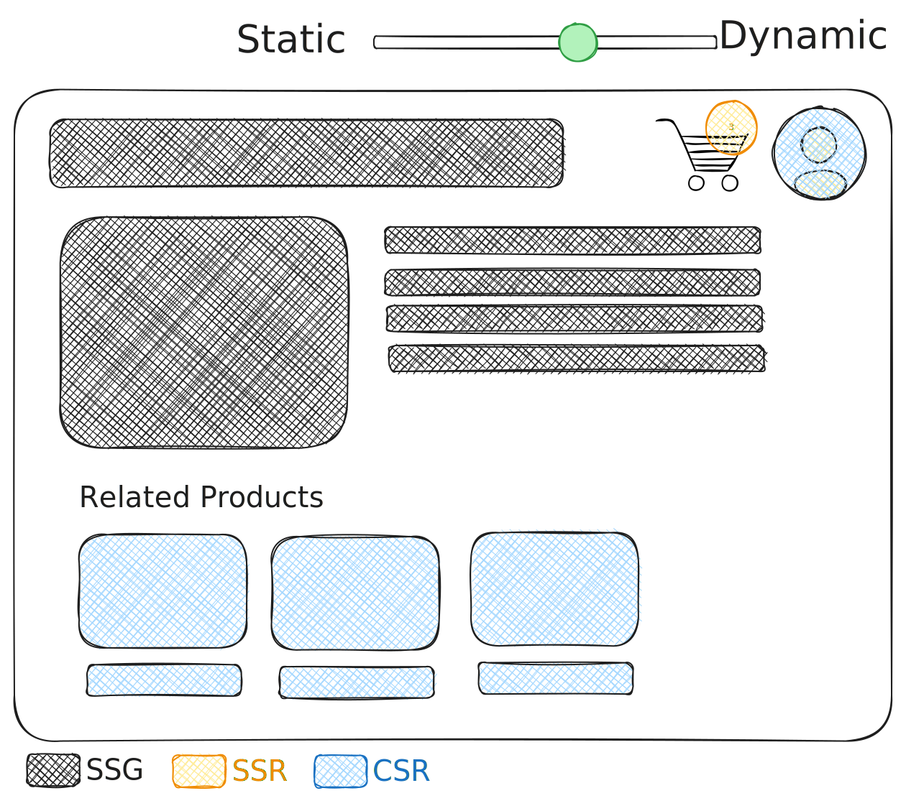
</div>

<!--
But now, compounding multiple paradigms in the same codebase, I can decide what kind of rendering I want for each specific slice of my application.

I can generate a static shell of my page with some placeholders, I can stream dynamic data as soon as they are ready.
For example to show the cart quantity icon.
And finally I can fetch additional less relevant data on the client.

All of this, nearly chosen component by component.

If you want to start making this choices, we saw all the small bricks you need to start making your own render strategy for your application.
-->

---

# Partial Pre-Rendering
<<< @/../05_next-partial-prerendering/next.config.js#app js {2-4}


<div v-click="1">

```js {1}
export const experimental_ppr = true;
export default function Page() {
  // ...
}
```

</div>

<div v-click="2">

``` {3-4,8}
$ npm run build

Route (app)                              Size     First Load JS
┌ ◐ /product/reactjsday-ticket           811 B          97.4 kB
└ ƒ /_not-found                          139 B          91.7 kB

○  (Static)             prerendered as static content
◐  (Partial Prerender)  prerendered as static HTML with dynamic server-streamed content
ƒ  (Dynamic)            server-rendered on demand
```
</div>

<!--
But if you want to give a try on this, Partial Pre-Rendering is a Next.js feature based on this approach.

Using Next.js 14 and laters , you can enable the experimental flag in the NextConfig.

Then, on the page you want to make it faster, export the const experimental_ppr.
This will produce a new _prerendered as static HTML with dynamic server-streamed content_ page.

Quick demo.
-->

---

# Partial Pre-Rendering

<Browser url="http://localhost:3005/" />

---

# Granular caching

- Static files / chunks
- Static pages
- Static pages' shells
- Data fetching
- Server-side computation

<!--
Multiple layer of rendering means multiple ways to cache data. Caching static-generated pages, or a data fetching result, or using memoization on computed component can boost our application more than ever.
-->

---

# Granular caching

<div class="grid grid-cols-2 gap-4">

<<< @/../06_my-next-app/src/app/promise-cached/page.tsx#date tsx {all|3-4|8-15|17|1,7|all}


<div v-click="5">
  <Browser url="http://localhost:3006/promise-cached" />
</div>

</div>

<!--
For example, we ask to compute query or calculations and keep it cached for 5 seconds.

We prepare the promise and we assign the promise when the component is called the first time.
Once the promise is resolved, it will stay resolved until someone will clear the cache.

unstable_noStore is just a way to tell Next.js to don't store this page as static.

Ok, this works. But please, do not this in production. It's just for study
-->

---

# Granular caching

<<< @/../06_my-next-app/src/app/promise-cached/page.tsx#cache tsx {all|4|5|6-8}

<!--
If you want something more stable (even if unstable) you can use cache function from next/cache.
(click) It creates a memoized function (click) with invalidation tags (click) and an expiration time.
-->

---

# BONUS TRACK - "use cache"

Just announced yesterday night at Next.js Conf 24, available for now with `npm i next@canary`

```js {all|2-8}
export default function PlaneDetails({id}) {
  "use cache";
  cacheTag(`plane-details-${id}`);
  cacheLife({
    stale: 300, // 5m
    revalidate: 3600, // 1h
    expire: 86400, // 1d
  });

  const details = await fetchPlaneDetails(id);
  // ...
}
```

Ref. https://nextjs.org/blog/our-journey-with-caching

<!--
Ok, Bonus track. I added this one tonight.

To keep an eye on the future, yesterday at Next.js Conf 24 the new directive "use cache" has been announced.
This will be allowed in pages, single components and single functions and will cache the results.
-->

---

# Nextjs cache approach

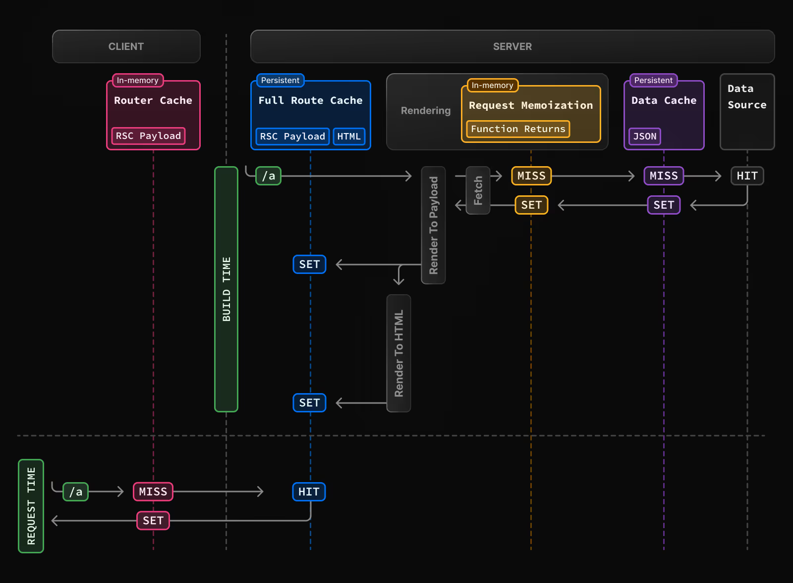

<!--
This is the chart of all cache layers introduced by Next.js to push to top level performances, but again you have all the basics to make your own engineering cache model
-->

---
layout: cover
class: text-center
---

# New communication abstraction

<!--
[17:00] Let's talk about "use server" and "use client".

With the introduction of React Server Components, we saw how every component is a Server Component by default, and we must specify "use client" to mark a Client Component

But what about "use server"?
-->

---

# Server Actions


<<< @/../06_my-next-app/src/app/server-action/page.tsx#app tsx {all|4-7|11|all}

<!--
Add `'use server'` at the top of an async function body to mark the function as callable by the client. We call these functions _Server Actions_. (click)

This means we run server-side code just invoking a function. (click)

Technically speaking, they are converted into API functions called with fetch on events.

In this case, we have a server components, with a server function and really few bytes of javascript bundle.
Actually we are writing code that doesn't go on the browser. Are we still frontend developers?
-->

---

# Server Actions

<<< @/../06_my-next-app/src/app/server-action/ClientSideMovieDetails.tsx#app tsx {all|1|2|8-9|all}

<!--
They are not only for server components.
(click)
In fact, they can be used by client components as normal functions as well.

(click)

The result is a special symbol with the reference of the function.

(click)

Calling API over the network means you must face latency, loading state, and all other UX problems.
-->

---

# useActionState

<<< @/../06_my-next-app/src/app/use-action-state/page.tsx#app tsx {all|6|11-14}

<!--
To help developers on this, React 19 introduces useActionState.

(click)

A new hook that accept an action (which is any async function that returns a value), and an initial value.

(click)

Calling the action, once the promise has been fulfilled the value will update with the promise's result.
-->

---
layout: cover
class: text-center
---

# Pitfalls


<!--
[20:00] Using a Fullstack framework allows us to shift code between the frontend and backend as needed. However, a Fullstack framework also introduces Fullstack challenges.
-->

---

# The fetch dilemma

```js
export async function fetchMovie(movie) {
 const response = await fetch(`https://backend.dev/api/movies/${movie.id}`, {
   headers: {
     'Content-Type': 'application/json',
     Authorization: 'secret-api-key',
   },
 });
 return response.json();
}
```


<div v-click="1" class="mt-4">

```jsx
export default async function MovieDetails({ params }) {
 const movie = await api.fetchMovie(params.movieId);

 return <h1>{movie.title}</h1>;
}
```

</div>

<!--
Let's see this function. I suppose everyone here has an utility file like this in their codebase, with all the api calls.

Now, let me ask a question: does this function will invoked on client or server?

How many vote for client? How many for server?

In fact, I've used this in a server component, to make it faster, with 0 bundle on the client, and to try this new approach too.
-->

---
layout: image
image: assets/boris-alessandro.webp
backgroundSize: cover
---

<!--
Next monday he is starting to work with us. He is a junior frontend developer. On his resume, there were 5 stars on React, and Github.

He already worked on React applications. And his first task will be a small feature in the reserved area to show the film's details preferred by the logged user.
-->

---

# The fetch dilemma

```jsx {all|0}
export default function MoviePreview() {
 const { id } = useParams();
 const [movie, setMovie] = useState(null);

 useEffect(() => {
   api.fetchMovie(id)
     .then(data => setMovie(data));
 }, [id]);

 return <h1>{movie.title}</h1>;
}
```

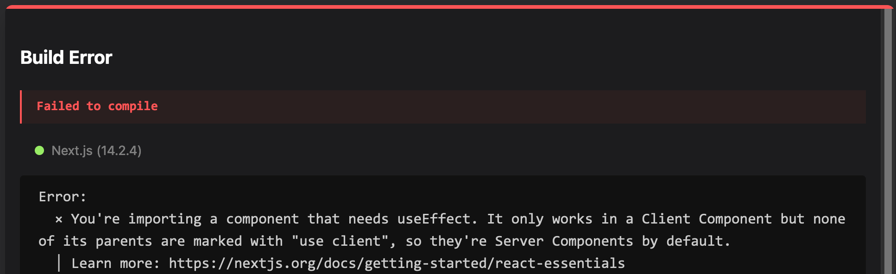

<!--
He prepared his component, he looked inside the codebase and found the api to call.
He knows how to make data fetching inside a components (spoiler, not this way).

On save, he got this error.
(click)

So he asked to ChatGPT (because reading the stack trace is a super senior's skill) and understood he must put "use client" on top of the file.
-->

---

# The fetch dilemma

```jsx {1|all}
"use client"
export default function MoviePreview() {
 const { id } = useParams();
 const [movie, setMovie] = useState(null);

 useEffect(() => {
   api.fetchMovie(id)
     .then(data => setMovie(data));
 }, [id]);

 return <h1>{movie.title}</h1>;
}
```

<!--
Easy peasy.
Everything is ready.

He saved, and what happened?

Nothing. Everything is working. The film's previews are there, and the feature had been complete without any issue.

Right?
-->

---
layout: image
image: assets/key-exposed.png
backgroundSize: contain
---

<!--
Except the fact that a function designed to be called in a server environment has been exposed on the client and our secrets has been shared to the world.

Yes, yes, I know, there are so many ways to avoid this...
-->

---

# The fetch dilemma

```js {5-6}
export async function fetchMovie(movie) {
 const response = await fetch(`https://backend.dev/api/movies/${movie.id}`, {
   headers: {
     'Content-Type': 'application/json',
     Authorization: process.env.NEXT_PUBLIC_API_KEY,
     Authorization: process.env.API_KEY,
   },
 });
 return response.json();
}
```

<!--
Like using protected env variables available only on clients or only on servers.
-->

---

# The fetch dilemma

```js {1}
import 'server-only'

export async function fetchMovie(movie) {
 const response = await fetch(`https://backend.dev/api/movies/${movie.id}`, {
   headers: {
     'Content-Type': 'application/json',
     Authorization: 'secret-api-key',
   },
 });
 return response.json();
}
```

<!--
... or using packages that stop builds...
-->

---

# The fetch dilemma

```js {1-3}
// facebook/react/compiler/packages/react-compiler-runtime/src/index.ts:17
const ReactSecretInternals =
 React.__SECRET_INTERNALS_DO_NOT_USE_OR_YOU_WILL_BE_FIRED;

export async function fetchMovie(movie) {
 const response = await fetch(`https://backend.dev/api/movies/${movie.id}`, {
   headers: {
     'Content-Type': 'application/json',
     Authorization: 'secret-api-key',
   },
 });
 return response.json();
}
```

<!--
or using explicit constants like Facebook's team does.
-->

---

# The fetch dilemma

```js
export async function fetchMovie(movie) {
 const response = await fetch(`https://backend.dev/api/movies/${movie.id}`, {
   headers: {
     'Content-Type': 'application/json',
     Authorization: 'secret-api-key',
   },
 });
 return response.json();
}
```

<!--
The point is that we must keep in mind if a single function is designed to be called in client, or in server, or both.

It's not difficult, of course! But it is one more cognitive effort we must face while debugging css gradients in the meantime.

And if you think this is a remote possibility, we should check around for incidents reports (click)
-->

---
layout: image
image: assets/resend-incident.png
backgroundSize: contain
---

<!--
because this is already happening around the world.
-->

---

# Client components w/ server components

```jsx {all|4}
// app/home/page.js
export default function Page() {
  return (
    <Header /> {/* (server) */}
  )
}

// src/components/header.js
export default function Header() {
  return (
    <>
      <UserAvatar /> {/* (server) */}
      <Widget /> {/* (client) */}
    </>
  )
}
```

<!--
Ok, let's talk about something less dangerous, but painful as well.

Let's say we have this architecture: an Header, server component, with inside a UserAvatar (server) and a random Widget that uses useState inside.

Our boss asks to us to have the animated snowflakes on the header and to make them happy we change the Header into a client component to install some random lib.
-->

---

# Client components w/ server components

```jsx {4|0}
// app/home/page.js
export default function Page() {
  return (
    <Header /> {/* (client) */}
  )
}

// src/components/header.js
export default function Header() {
  return (
    <>
      <UserAvatar /> {/* (server) */}
      <Widget /> {/* (client) */}
    </>
  )
}
```

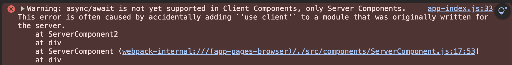

<!--
And of course, as we all know, (click) a Server Component cannot be called inside a client component.

Unsolvable problem? It's not! But to do this, you should make a big refactoring of composition which can take a lot of time.

Does it worth?
-->

---

# Data through the network

```jsx {all|1,2,8,12|1,2,6,8,12}
async function deletePrivateMessage(userId, msgId) {
  "use server"
  assertUserCanEditMessage(userId, msgId);
  return {
    ok: `Message ${msgId} deleted from user ${userId}`,
    date: new Date(),
  };
}

export default async function Page({ params }) {
 const userId = await getUserIdFromCookie();
 const action = deletePrivateMessage.bind(null, userId, params.msgId);

 return (
   <div>
     <h1>Your own secret message: {params.msg}</h1>
     <form action={action}><button type="submit">Delete</button></form>
   </div>
 )
}
```

<!--
Let's talk about server actions. We have our a server action, called in a form action.

We said that function will be encapsulated into an API call, invoked over the network.
To pass data over the network, what do we need? To serialize data.

But not everything is serializable of course. The point is we are not used to have a function in a file, invoked few lines below that instead is an api call under the hood.
-->

---

# Data through the network

<div class="grid grid-cols-2 gap-4">

```jsx {1,12-13,18-20}
async function deletePrivateMessage(userId, msgId) {
  "use server"
  assertUserCanEditMessage(userId, msgId);
  return {
    ok: `Message ${msgId} deleted from user ${userId}`,
    date: new Date(),
  };
}

export default async function Page({ params }) {
 const userId = await getUserIdFromCookie();
 const action = deletePrivateMessage
  .bind(null, userId, params.msgId);

 return (
   <div>
    <h1>Your own secret message: {params.msg}</h1>
    <form action={action}>
      <button type="submit">Delete</button>
    </form>
  </div>
 )
}
```

<v-switch>
  <template #1>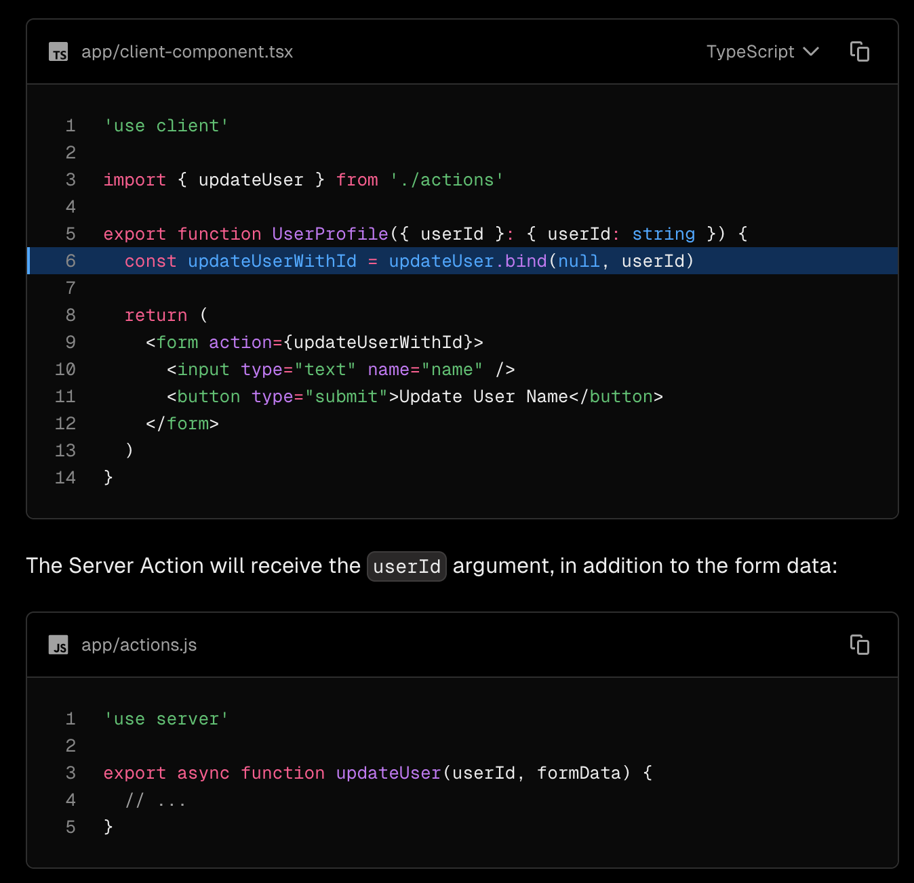</template>
  <template #2></template>
  <template #3>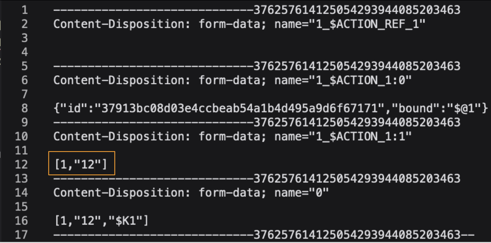</template>
</v-switch>

</div>

<!--
Then, let's focus on that bind.
Probably a lot of people in this room writes this kind of code, me included.(click) Especially if it is suggested in the examples of Next.js.

(click)

But what happened on the network in this case?
-->

---

# Data through network

```{1,2,13,16}
curl -X POST 'http://localhost:3000/leak/12'
-H 'Next-Action: 37913bc08d03e4ccbeab54a1b4d495a9d6f67171'
-H 'Next-Router-State-Tree: [...]'
-H 'Content-Type: multipart/form-data; boundary=---------------------------30876848151661608003309433030'
--data-binary $'
 -----------------------------30876848151661608003309433030
Content-Disposition: form-data; name="1_$ACTION_REF_1"
 -----------------------------30876848151661608003309433030
Content-Disposition: form-data; name="1_$ACTION_1:0"
{"id":"37913bc08d03e4ccbeab54a1b4d495a9d6f67171","bound":"$@1"}
 -----------------------------30876848151661608003309433030
Content-Disposition: form-data; name="1_$ACTION_1:1"
[2,"12"]
 ----------------------------30876848151661608003309433030
Content-Disposition: form-data; name="0"
[2,"12","$K1"]
 -----------------------------30876848151661608003309433030--'
```

<!--
Changing the parameter for the API call, we should be able to delete messages for all users.

And we are lucky if we'll lost only messages.

By the way, even this time it's not just a constructed example..
-->

---

# Data through network


Source: https://x.com/kossnocorp/status/1797472154683879566

<!--
Sasha Koss, open source developer, maintainer of date-fns, realized in time the security breach.
-->

---

# Data through network

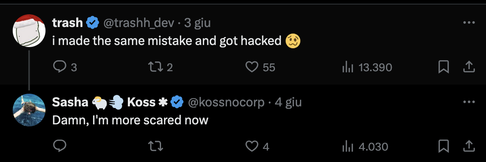

<!--
But not so fast was another developer (platform in netflix).

The point is not React Server Components, or Server Actions, are not secure. But just we're facing new problems derived from new paradigms.
-->

---

# Infrastracture management

<div class="h-full text-center">
  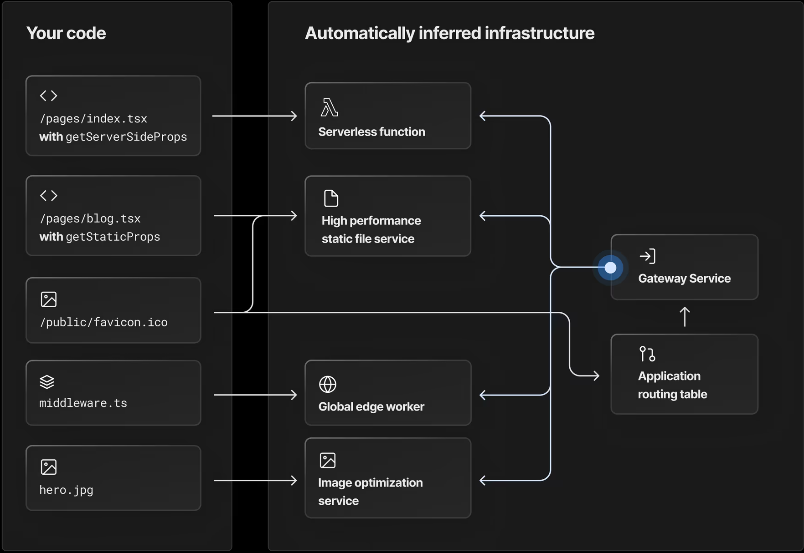
</div>

<!--
Let's close with this.
All those abstraction layer are used to split our application in multiple small services. The static files and the static pages delivered on the edge, middlewares on the edge workers, serverless functions for server actions and server components.

This is an amazing chart of the all services under the hood, that I've taken from a company that maybe you don't know.

But what if we want to host our web application on our cloud?
-->

---
class: text-left
---

# Infrastracture management

> ### Self-hosting
>
> You can self-host Next.js in three different ways:
>
> - A Node.js server
> - A Docker container
> - A static export

Ref: https://nextjs.org/docs/app/building-your-application/deploying#self-hosting

<!--
Ehm.. where are all my services? How should I configure my cloudfront for this?

We have no more time to go deeper, but I'm sure you got the point.
-->

---

# Debugging

<br />
<br />
<br />
<br />
<br />
<br />
<br />

<h2 v-click="1">Have fun! 😰</h2>

<!--
last, but not the least.

How many of you knows how to debug React? Or use the profiler inside web developer tools. Ok ok.. and how many of you knows how to debug an advanced node.js multi-thread application?
-->

---
layout: cover
class: text-center
---

# In conclusion...

<!--
[30:00]
-->

---
layout: cover
class: text-center
---

# Consciousness

<!--
Use consciousness when start adopting these new amazing feaures.
-->

---

# Final thoughts

- Modern frameworks' gold rush
- Complex and powerful render paradigms made easy
- Incredible UXs

- Fullstack frameworks mean fullstack problems
- Instability of experimentation
- Infrastracture complexity, sometimes out of controls

<!--
- Modern frameworks are growing fast in every possible direction
- Moving complexity from frontend to backend and viceversa enables us to ship incredible user experiences
- ... but also introduces a new kind of _fullstack_ problems to face, and everything is running so fast.

I feel the ecosystem is like startups: fail fast and breaking things.
-->

---

# Final thoughts

> ### Here's what is new in Next.js 15:
>  - @next/codemod CLI: Easily upgrade to the latest Next.js and React versions.
>  - Async Request APIs **(Breaking)**: Incremental step towards a simplified rendering and caching model.
>  - Caching Semantics **(Breaking)**: fetch requests, GET Route Handlers, and client navigations are no longer cached by default.
>  - ...

Ref: https://nextjs.org/blog/next-15 _Monday, October 21st 2024_


<!--
My fear is that, except if you have a big team of software engineers dedicated to platform or R&D, follow this instability and change our application everytime a new iteration has been released can cost more than benefit we get.


-->

---
layout: cover
class: text-center
---

## Every new features or abstractions<br />have been designed for specific problems,<br />that _may not match yours_.

<!-- and probably it's not yet time to retire the SPAs. -->

---

# Grazie!

<div class="flex flex-row">

<div>

- https://www.linkedin.com/in/matteo-manchi/
- https://x.com/matteomanchi
- Slide and code at<br />https://github.com/Takeno/Do-Frontend-Devs-dream-of-Backend-functions

  
</div>

<div>

  

  Please don't hesitate to share your feedback!

</div>
</div>
